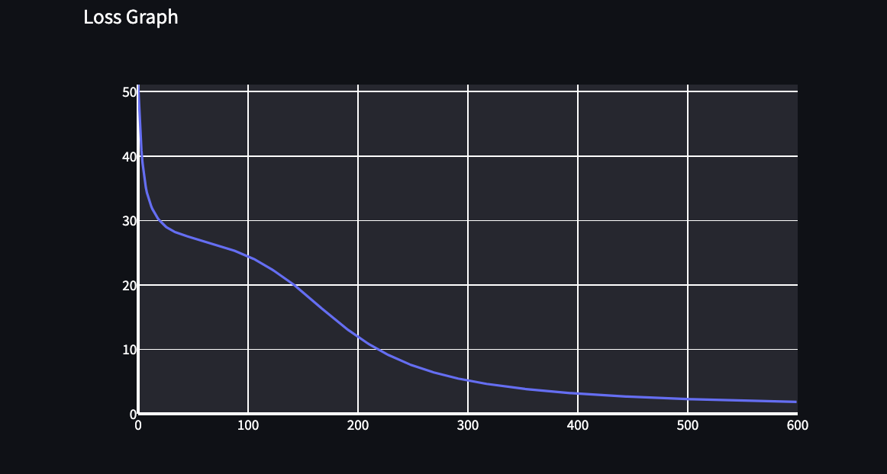

[](https://classroom.github.com/a/YFgwt0yY)
# MiniTorch Module 2


* Docs: https://minitorch.github.io/

* Overview: https://minitorch.github.io/module2/module2/

This assignment requires the following files from the previous assignments. You can get these by running

```bash
python sync_previous_module.py previous-module-dir current-module-dir
```

The files that will be synced are:

        minitorch/operators.py minitorch/module.py minitorch/autodiff.py minitorch/scalar.py minitorch/scalar_functions.py minitorch/module.py project/run_manual.py project/run_scalar.py project/datasets.py


Module 1 Results

## Simple
Inputs: \
70 data points\
4 hidden layers\
0.1 learning rate \
600 epochs \
Training time per epoch 0.166s


Longform Terminal Output:
Epoch: 0/600, loss: 0, correct: 0
Epoch: 10/600, loss: 49.24077020768928, correct: 34
Epoch: 20/600, loss: 47.58440350606423, correct: 34
Epoch: 30/600, loss: 46.35163747398168, correct: 34
Epoch: 40/600, loss: 45.31392704289874, correct: 34
Epoch: 50/600, loss: 44.35649089830211, correct: 44
Epoch: 60/600, loss: 43.40392084243487, correct: 56
Epoch: 70/600, loss: 42.392461782109756, correct: 58
Epoch: 80/600, loss: 41.2697874320519, correct: 61
Epoch: 90/600, loss: 40.010379525785716, correct: 62
Epoch: 100/600, loss: 38.59667767312654, correct: 63
Epoch: 110/600, loss: 37.01192765864899, correct: 64
Epoch: 120/600, loss: 35.2591296387494, correct: 65
Epoch: 130/600, loss: 33.35669432507495, correct: 65
Epoch: 140/600, loss: 31.320897289410937, correct: 65
Epoch: 150/600, loss: 29.179418282946813, correct: 67
Epoch: 160/600, loss: 27.001085871158512, correct: 67
Epoch: 170/600, loss: 24.837402537041033, correct: 69
Epoch: 180/600, loss: 22.731514362265163, correct: 69
Epoch: 190/600, loss: 20.724305081814634, correct: 69
Epoch: 200/600, loss: 18.858277297993286, correct: 69
Epoch: 210/600, loss: 17.15132350807866, correct: 69
Epoch: 220/600, loss: 15.614410002737525, correct: 69
Epoch: 230/600, loss: 14.245615252231413, correct: 70
Epoch: 240/600, loss: 13.041147985201615, correct: 70
Epoch: 250/600, loss: 11.974023599300308, correct: 70
Epoch: 260/600, loss: 11.041168096465405, correct: 70
Epoch: 270/600, loss: 10.21954655556176, correct: 70
Epoch: 280/600, loss: 9.494293285652583, correct: 70
Epoch: 290/600, loss: 8.860089018019563, correct: 70
Epoch: 300/600, loss: 8.303567022025895, correct: 70
Epoch: 310/600, loss: 7.810067103241108, correct: 70
Epoch: 320/600, loss: 7.369439444984525, correct: 70
Epoch: 330/600, loss: 6.978370530450365, correct: 70
Epoch: 340/600, loss: 6.626756612044754, correct: 70
Epoch: 350/600, loss: 6.312691906260105, correct: 70
Epoch: 360/600, loss: 6.03066079354236, correct: 70
Epoch: 370/600, loss: 5.774223811114309, correct: 70
Epoch: 380/600, loss: 5.542080027426391, correct: 70
Epoch: 390/600, loss: 5.329344852252981, correct: 70
Epoch: 400/600, loss: 5.1336637680044825, correct: 70
Epoch: 410/600, loss: 4.954577854843528, correct: 70
Epoch: 420/600, loss: 4.789568214649052, correct: 70
Epoch: 430/600, loss: 4.636357136217956, correct: 70
Epoch: 440/600, loss: 4.494132326124223, correct: 70
Epoch: 450/600, loss: 4.360910224818362, correct: 70
Epoch: 460/600, loss: 4.235711540424877, correct: 70
Epoch: 470/600, loss: 4.117805100689549, correct: 70
Epoch: 480/600, loss: 4.00767344053994, correct: 70
Epoch: 490/600, loss: 3.9036223691067464, correct: 70
Epoch: 500/600, loss: 3.8050361147208935, correct: 70
Epoch: 510/600, loss: 3.711487785596884, correct: 70
Epoch: 520/600, loss: 3.622595810147424, correct: 70
Epoch: 530/600, loss: 3.5380174340046113, correct: 70
Epoch: 540/600, loss: 3.4574434586099496, correct: 70
Epoch: 550/600, loss: 3.380645823816736, correct: 70
Epoch: 560/600, loss: 3.3077149277604243, correct: 70
Epoch: 570/600, loss: 3.2379705665404837, correct: 70
Epoch: 580/600, loss: 3.1712053817984995, correct: 70
Epoch: 590/600, loss: 3.107230459711043, correct: 70
Epoch: 600/600, loss: 3.0458724554211023, correct: 70


## Diag
Inputs: \
67 data points\
6 hidden layers \
0.1 learning rate \
600 epochs \
Training time per epoch 0.270s





Longform Terminal Output:
Epoch: 0/600, loss: 0, correct: 0
Epoch: 10/600, loss: 33.63955757483456, correct: 57
Epoch: 20/600, loss: 30.074837401307228, correct: 57
Epoch: 30/600, loss: 28.609113068785458, correct: 57
Epoch: 40/600, loss: 27.84805488476921, correct: 57
Epoch: 50/600, loss: 27.33234534281849, correct: 57
Epoch: 60/600, loss: 26.864348211307927, correct: 57
Epoch: 70/600, loss: 26.369588756936583, correct: 57
Epoch: 80/600, loss: 25.82954579180072, correct: 57
Epoch: 90/600, loss: 25.224273427894087, correct: 57
Epoch: 100/600, loss: 24.528490702875917, correct: 57
Epoch: 110/600, loss: 23.692896127621918, correct: 57
Epoch: 120/600, loss: 22.69471719546547, correct: 57
Epoch: 130/600, loss: 21.59562695210463, correct: 57
Epoch: 140/600, loss: 20.380356025676004, correct: 57
Epoch: 150/600, loss: 19.002557591324926, correct: 57
Epoch: 160/600, loss: 17.53147276176805, correct: 57
Epoch: 170/600, loss: 16.054768935774028, correct: 57
Epoch: 180/600, loss: 14.636725363924382, correct: 61
Epoch: 190/600, loss: 13.281477382396556, correct: 65
Epoch: 200/600, loss: 12.03755552909306, correct: 65
Epoch: 210/600, loss: 10.912676544153582, correct: 65
Epoch: 220/600, loss: 9.91034885912095, correct: 66
Epoch: 230/600, loss: 9.018440410002404, correct: 66
Epoch: 240/600, loss: 8.231345283672379, correct: 66
Epoch: 250/600, loss: 7.542946986998743, correct: 66
Epoch: 260/600, loss: 6.941509839348116, correct: 67
Epoch: 270/600, loss: 6.417448112372094, correct: 67
Epoch: 280/600, loss: 5.9568991429342875, correct: 67
Epoch: 290/600, loss: 5.552043960799684, correct: 67
Epoch: 300/600, loss: 5.193290847941291, correct: 67
Epoch: 310/600, loss: 4.874159545502896, correct: 67
Epoch: 320/600, loss: 4.590689211721555, correct: 67
Epoch: 330/600, loss: 4.339665232680778, correct: 67
Epoch: 340/600, loss: 4.114388003298607, correct: 67
Epoch: 350/600, loss: 3.910885571195378, correct: 67
Epoch: 360/600, loss: 3.7267541685554213, correct: 67
Epoch: 370/600, loss: 3.5599717676773897, correct: 67
Epoch: 380/600, loss: 3.408919182964671, correct: 67
Epoch: 390/600, loss: 3.2711691425066003, correct: 67
Epoch: 400/600, loss: 3.144769593404698, correct: 67
Epoch: 410/600, loss: 3.0282738048868896, correct: 67
Epoch: 420/600, loss: 2.9207948428320423, correct: 67
Epoch: 430/600, loss: 2.821323131033792, correct: 67
Epoch: 440/600, loss: 2.729024427209704, correct: 67
Epoch: 450/600, loss: 2.643576105408656, correct: 67
Epoch: 460/600, loss: 2.5639516720356688, correct: 67
Epoch: 470/600, loss: 2.489607983226343, correct: 67
Epoch: 480/600, loss: 2.4201366093556906, correct: 67
Epoch: 490/600, loss: 2.3552065095887027, correct: 67
Epoch: 500/600, loss: 2.294339742424097, correct: 67
Epoch: 510/600, loss: 2.2371255301171615, correct: 67
Epoch: 520/600, loss: 2.183207775027987, correct: 67
Epoch: 530/600, loss: 2.1323385739584233, correct: 67
Epoch: 540/600, loss: 2.084321013711715, correct: 67
Epoch: 550/600, loss: 2.0389028842350543, correct: 67
Epoch: 560/600, loss: 1.9958188992208739, correct: 67
Epoch: 570/600, loss: 1.9549028293673876, correct: 67
Epoch: 580/600, loss: 1.9159875664747883, correct: 67
Epoch: 590/600, loss: 1.8789349649248794, correct: 67
Epoch: 600/600, loss: 1.843680284340368, correct: 67


## Split
Inputs: \
76 data points\
10 hidden layers \
0.1 learning rate \
900 epochs
Training time per epoch 0.667s


Longform Terminal Output:
Epoch: 0/900, loss: 0, correct: 0
Epoch: 10/900, loss: 48.533150199572674, correct: 51
Epoch: 20/900, loss: 47.94910100150007, correct: 51
Epoch: 30/900, loss: 47.623365812664694, correct: 51
Epoch: 40/900, loss: 47.41483493093353, correct: 51
Epoch: 50/900, loss: 47.20915671954948, correct: 51
Epoch: 60/900, loss: 47.02503312726305, correct: 51
Epoch: 70/900, loss: 46.8392369104161, correct: 51
Epoch: 80/900, loss: 46.674096824543916, correct: 51
Epoch: 90/900, loss: 46.508844200713256, correct: 51
Epoch: 100/900, loss: 46.35943640185782, correct: 51
Epoch: 10/900, loss: 46.49851289725735, correct: 60
Epoch: 20/900, loss: 45.608986186641026, correct: 57
Epoch: 30/900, loss: 44.91227572909656, correct: 55
Epoch: 40/900, loss: 44.171930434111246, correct: 53
Epoch: 50/900, loss: 43.40791294723212, correct: 52
Epoch: 60/900, loss: 42.61564710580272, correct: 53
Epoch: 70/900, loss: 41.74442333076109, correct: 55
Epoch: 80/900, loss: 40.77341929795914, correct: 56
Epoch: 90/900, loss: 39.70408020524941, correct: 57
Epoch: 100/900, loss: 38.5407489380114, correct: 57
Epoch: 110/900, loss: 37.27392114335878, correct: 57
Epoch: 120/900, loss: 35.87917107453068, correct: 58
Epoch: 130/900, loss: 34.392636356455014, correct: 62
Epoch: 140/900, loss: 32.82324679853464, correct: 63
Epoch: 150/900, loss: 31.191809610400924, correct: 66
Epoch: 160/900, loss: 29.526900031038135, correct: 69
Epoch: 170/900, loss: 27.863727552149737, correct: 70
Epoch: 180/900, loss: 26.247494974831735, correct: 71
Epoch: 190/900, loss: 24.670166924086665, correct: 71
Epoch: 200/900, loss: 23.156722323819004, correct: 72
Epoch: 210/900, loss: 21.724493544886663, correct: 72
Epoch: 220/900, loss: 20.382254434261643, correct: 73
Epoch: 230/900, loss: 19.132817802285555, correct: 74
Epoch: 240/900, loss: 17.97667232972595, correct: 75
Epoch: 250/900, loss: 16.912391788506728, correct: 75
Epoch: 260/900, loss: 15.935389260674649, correct: 75
Epoch: 270/900, loss: 15.03738067004332, correct: 75
Epoch: 280/900, loss: 14.211747203317904, correct: 75
Epoch: 290/900, loss: 13.452333450255217, correct: 75
Epoch: 300/900, loss: 12.75324535408371, correct: 75
Epoch: 310/900, loss: 12.109031399175054, correct: 75
Epoch: 320/900, loss: 11.514665500875733, correct: 75
Epoch: 330/900, loss: 10.965558040498378, correct: 75
Epoch: 340/900, loss: 10.457877658192423, correct: 75
Epoch: 350/900, loss: 9.988795678024083, correct: 75
Epoch: 360/900, loss: 9.553564219495684, correct: 75
Epoch: 370/900, loss: 9.149696401232223, correct: 76
Epoch: 380/900, loss: 8.773341242889684, correct: 76
Epoch: 390/900, loss: 8.422304641320386, correct: 76
Epoch: 400/900, loss: 8.0944038003292, correct: 76
Epoch: 410/900, loss: 7.788414791527807, correct: 76
Epoch: 420/900, loss: 7.50180310285021, correct: 76
Epoch: 430/900, loss: 7.232965631243958, correct: 76
Epoch: 440/900, loss: 6.980364978543271, correct: 76
Epoch: 450/900, loss: 6.742833594250461, correct: 76
Epoch: 460/900, loss: 6.5191189411605, correct: 76
Epoch: 470/900, loss: 6.308346532789643, correct: 76
Epoch: 480/900, loss: 6.109658252418494, correct: 76
Epoch: 490/900, loss: 5.921837581755041, correct: 76
Epoch: 500/900, loss: 5.744085397497278, correct: 76
Epoch: 510/900, loss: 5.5756918488774705, correct: 76
Epoch: 520/900, loss: 5.416081380537505, correct: 76
Epoch: 530/900, loss: 5.264623855537298, correct: 76
Epoch: 540/900, loss: 5.120789513303319, correct: 76
Epoch: 550/900, loss: 4.984064422897418, correct: 76
Epoch: 560/900, loss: 4.853999882320452, correct: 76
Epoch: 570/900, loss: 4.730164741447282, correct: 76
Epoch: 580/900, loss: 4.612171999671206, correct: 76
Epoch: 590/900, loss: 4.499641590168008, correct: 76
Epoch: 600/900, loss: 4.392240139340395, correct: 76
Epoch: 610/900, loss: 4.289672842763153, correct: 76
Epoch: 620/900, loss: 4.191654557509308, correct: 76
Epoch: 630/900, loss: 4.097904833220875, correct: 76
Epoch: 640/900, loss: 4.008174411582734, correct: 76
Epoch: 650/900, loss: 3.9222330558928213, correct: 76
Epoch: 660/900, loss: 3.8398670115571476, correct: 76
Epoch: 670/900, loss: 3.7608750572141765, correct: 76
Epoch: 680/900, loss: 3.685072027447437, correct: 76
Epoch: 690/900, loss: 3.612287225743802, correct: 76
Epoch: 700/900, loss: 3.5423697645814616, correct: 76
Epoch: 710/900, loss: 3.4751523565468947, correct: 76
Epoch: 720/900, loss: 3.410493750178194, correct: 76
Epoch: 730/900, loss: 3.3482616366285347, correct: 76
Epoch: 740/900, loss: 3.288331756786558, correct: 76
Epoch: 750/900, loss: 3.2305882640808714, correct: 76
Epoch: 760/900, loss: 3.174924302040428, correct: 76
Epoch: 770/900, loss: 3.121238138959211, correct: 76
Epoch: 780/900, loss: 3.0694294004397866, correct: 76
Epoch: 790/900, loss: 3.019409107176145, correct: 76
Epoch: 800/900, loss: 2.971097295183493, correct: 76
Epoch: 810/900, loss: 2.9244106911726777, correct: 76
Epoch: 820/900, loss: 2.879267821018546, correct: 76
Epoch: 830/900, loss: 2.8355972960407234, correct: 76
Epoch: 840/900, loss: 2.7933321168440757, correct: 76
Epoch: 850/900, loss: 2.752408704149964, correct: 76
Epoch: 860/900, loss: 2.712767233956719, correct: 76
Epoch: 870/900, loss: 2.674351079080697, correct: 76
Epoch: 880/900, loss: 2.6371067251623077, correct: 76
Epoch: 890/900, loss: 2.600983414174728, correct: 76
Epoch: 900/900, loss: 2.5659353412735917, correct: 76


## XOR
Inputs: \
63 data points\
15 hidden layers \
0.1 learning rate \
850 epochs
Training time per epoch 740.58s


Longform Terminal Output:

Epoch: 0/850, loss: 0, correct: 0
Epoch: 10/850, loss: 43.42382239353978, correct: 33
Epoch: 20/850, loss: 42.863690501442214, correct: 40
Epoch: 30/850, loss: 42.535111271446524, correct: 40
Epoch: 40/850, loss: 42.243692507616565, correct: 40
Epoch: 50/850, loss: 42.0369672442194, correct: 40
Epoch: 60/850, loss: 41.86226885069345, correct: 40
Epoch: 70/850, loss: 41.705054071542854, correct: 40
Epoch: 80/850, loss: 41.566339718426335, correct: 38
Epoch: 90/850, loss: 41.41316419753402, correct: 39
Epoch: 10/850, loss: 42.07610480525626, correct: 35
Epoch: 20/850, loss: 41.78910338816909, correct: 37
Epoch: 10/850, loss: 43.02143765874501, correct: 37
Epoch: 20/850, loss: 41.542157768450345, correct: 37
Epoch: 30/850, loss: 40.966066009235114, correct: 37
Epoch: 10/850, loss: 42.07662885070201, correct: 35
Epoch: 20/850, loss: 41.426747401887596, correct: 40
Epoch: 10/850, loss: 41.484307230787785, correct: 35
Epoch: 20/850, loss: 40.30044347057409, correct: 42
Epoch: 30/850, loss: 39.30734723323348, correct: 47
Epoch: 40/850, loss: 38.42464826394504, correct: 50
Epoch: 50/850, loss: 37.20341419308283, correct: 52
Epoch: 60/850, loss: 36.09195645700631, correct: 53
Epoch: 70/850, loss: 34.97824648849713, correct: 52
Epoch: 80/850, loss: 33.97830000088336, correct: 51
Epoch: 90/850, loss: 33.01642901209197, correct: 50
Epoch: 100/850, loss: 32.13451929448306, correct: 51
Epoch: 110/850, loss: 31.195513929795407, correct: 52
Epoch: 120/850, loss: 30.304907540356183, correct: 53
Epoch: 130/850, loss: 29.456915173810827, correct: 53
Epoch: 140/850, loss: 28.642107502804024, correct: 53
Epoch: 150/850, loss: 27.844215111816307, correct: 54
Epoch: 160/850, loss: 27.051061394702938, correct: 54
Epoch: 170/850, loss: 26.261091251198913, correct: 54
Epoch: 180/850, loss: 25.48980353565785, correct: 55
Epoch: 190/850, loss: 24.713963961785975, correct: 57
Epoch: 200/850, loss: 23.931469795575946, correct: 57
Epoch: 210/850, loss: 23.14560799857138, correct: 57
Epoch: 220/850, loss: 22.357719004391196, correct: 58
Epoch: 230/850, loss: 21.580886975937684, correct: 58
Epoch: 240/850, loss: 20.823178324264795, correct: 58
Epoch: 250/850, loss: 20.073336177447842, correct: 59
Epoch: 260/850, loss: 19.331598102248467, correct: 60
Epoch: 270/850, loss: 18.603306818612143, correct: 61
Epoch: 280/850, loss: 17.891697724944883, correct: 62
Epoch: 290/850, loss: 17.201501663583883, correct: 62
Epoch: 300/850, loss: 16.527036132747227, correct: 62
Epoch: 310/850, loss: 15.868338025016925, correct: 62
Epoch: 320/850, loss: 15.231053490772608, correct: 62
Epoch: 330/850, loss: 14.620618750010086, correct: 62
Epoch: 340/850, loss: 14.01615423267864, correct: 63
Epoch: 350/850, loss: 13.44611074038743, correct: 63
Epoch: 360/850, loss: 12.899242973440426, correct: 63
Epoch: 370/850, loss: 12.379870539950913, correct: 63
Epoch: 380/850, loss: 11.884217816923671, correct: 63
Epoch: 390/850, loss: 11.412110416979912, correct: 63
Epoch: 400/850, loss: 10.965367252716051, correct: 63
Epoch: 410/850, loss: 10.540021889289461, correct: 63
Epoch: 420/850, loss: 10.137852113020424, correct: 63
Epoch: 430/850, loss: 9.758400928710579, correct: 63
Epoch: 440/850, loss: 9.403070572574704, correct: 63
Epoch: 450/850, loss: 9.064657313117708, correct: 62
Epoch: 460/850, loss: 8.744990512736491, correct: 62
Epoch: 470/850, loss: 8.442387177717933, correct: 62
Epoch: 480/850, loss: 8.157600291179161, correct: 62
Epoch: 490/850, loss: 7.890696111111335, correct: 62
Epoch: 500/850, loss: 7.633263041559551, correct: 62
Epoch: 510/850, loss: 7.388804121549677, correct: 62
Epoch: 520/850, loss: 7.158530497796984, correct: 62
Epoch: 530/850, loss: 6.940687468318133, correct: 62
Epoch: 540/850, loss: 6.736637349818813, correct: 62
Epoch: 550/850, loss: 6.536572400421881, correct: 62
Epoch: 560/850, loss: 6.342397992193771, correct: 62
Epoch: 570/850, loss: 6.161732459901803, correct: 62
Epoch: 580/850, loss: 5.988740887866284, correct: 62
Epoch: 590/850, loss: 5.819358772428886, correct: 62
Epoch: 600/850, loss: 5.659364118495934, correct: 62
Epoch: 610/850, loss: 5.507095981101646, correct: 62
Epoch: 620/850, loss: 5.366187983966517, correct: 62
Epoch: 630/850, loss: 5.229646326928568, correct: 62
Epoch: 640/850, loss: 5.103221688305497, correct: 62
Epoch: 650/850, loss: 4.9790396073483905, correct: 62
Epoch: 660/850, loss: 4.8638092527811665, correct: 62
Epoch: 670/850, loss: 4.753139049046889, correct: 62
Epoch: 680/850, loss: 4.647232912816888, correct: 62
Epoch: 690/850, loss: 4.547655182429921, correct: 62
Epoch: 700/850, loss: 4.45069703545259, correct: 62
Epoch: 710/850, loss: 4.360254901136823, correct: 62
Epoch: 720/850, loss: 4.270353461620904, correct: 63
Epoch: 730/850, loss: 4.185898524990773, correct: 63
Epoch: 740/850, loss: 4.10594955997896, correct: 63
Epoch: 750/850, loss: 4.0256965482387965, correct: 63
Epoch: 760/850, loss: 3.950086506068652, correct: 63
Epoch: 770/850, loss: 3.8767112596019198, correct: 63
Epoch: 780/850, loss: 3.8063354732154044, correct: 63
Epoch: 790/850, loss: 3.739323885336597, correct: 63
Epoch: 800/850, loss: 3.6728383086285237, correct: 63
Epoch: 810/850, loss: 3.608328142623905, correct: 63
Epoch: 820/850, loss: 3.545769929660642, correct: 63
Epoch: 830/850, loss: 3.4878089996684305, correct: 63
Epoch: 840/850, loss: 3.4284521201898914, correct: 63
Epoch: 850/850, loss: 3.371224011537696, correct: 63